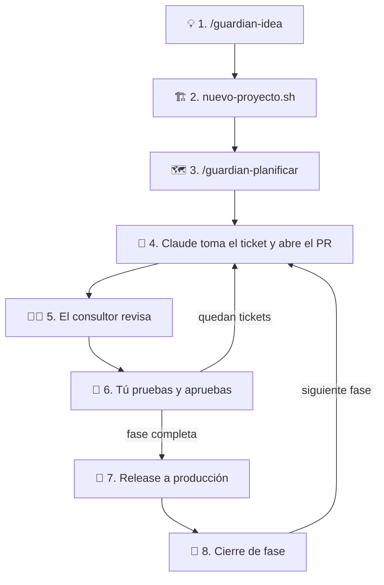

# Guardián

[](https://github.com/jjhoncv/guardian/actions/workflows/ci.yml)
[](https://github.com/jjhoncv/guardian/actions/workflows/deploy.yml)
[](https://github.com/jjhoncv/guardian/actions/workflows/release.yml)
[](https://github.com/jjhoncv/guardian/milestones)
[](https://github.com/jjhoncv/guardian/actions/workflows/ci.yml)
[](https://github.com/jjhoncv/guardian/actions/workflows/estado.yml)

**Tus proyectos terminan.** El Guardián toma una idea, la convierte en un alcance fijo con fases chicas, la pone en producción desde el día 1 y deja que **Claude la desarrolle por tickets** mientras tú solo pruebas y apruebas. Lo que no está en el alcance va al *Parking lot*, no al proyecto.

- **Fase, avance y salud:** los badges de arriba se actualizan solos en cada merge y una vez al día (🟢 🟡 🔴 ⚫, [qué significa cada color](PROYECTO.md#11-barra-de-salud)) · **Novedades:** [`CHANGELOG.md`](CHANGELOG.md)
- **Alcance y reglas:** [`PROYECTO.md`](PROYECTO.md) · **Decisiones:** [`docs/decisiones/`](docs/decisiones/README.md) · **Tablero:** [Projects](https://github.com/users/jjhoncv/projects/1)
- **Staging:** https://staging--guardian-jjhoncv.netlify.app · **Producción:** https://guardian-jjhoncv.netlify.app

## Quién hace qué

| | Quién | Qué hace |
|---|---|---|
| 👤 | **Tú** (dueño) | Defines la idea, pruebas en el preview, apruebas y decides |
| 🤖 | **Claude desarrollador** | Claude en la nube, dentro de cada proyecto: toma los tickets, escribe pruebas y código, y abre PRs chicos |
| 🧑‍🏫 | **Consultor** | Claude Code en tu terminal, en este repo: revisa lo que hizo Claude desarrollador, corrige y lo vuelve **lección** para que no se repita ([`docs/consultor/`](docs/consultor/)) |
| 🛡️ | **Guardián** | Este repo: los workflows y las reglas que cuidan el alcance, las fases y los ambientes |
| 📦 | **[guardian-skeleton](https://github.com/jjhoncv/guardian-skeleton)** | Con lo que nace cada proyecto: `CLAUDE.md`, lecciones y plantillas |

## Los comandos

| Comando | Dónde lo usas | Para qué |
|---|---|---|
| `/guardian` | Aquí o en un proyecto | **Menú:** en qué paso estás, qué falta y el siguiente paso |
| `/guardian-idea` | Aquí | Idea → ficha → alcance (`PROYECTO.md`) y nombre. No crea nada |
| `scripts/nuevo-proyecto.sh` | Terminal, aquí | Crea el sitio, el repo, los secretos y las protecciones, y sube el esqueleto con tu alcance |
| `/guardian-planificar` | En el proyecto | Alcance → escenarios BDD + plan de tickets |
| `@claude` | Comentario en un ticket o PR | Le pides algo a Claude desarrollador (solo te obedece a ti) |
| `/guardian-consultor` | Aquí | El consultor revisa un PR de Claude y lo vuelve lección |

## Un proyecto de punta a punta (ejemplo)

Idea: **«Vencimientos»**, una página donde ves qué etiquetas de producto están activas y cuáles vencen esta semana, leídas de una hoja de Google. Tipo: **prueba / MVP rápido**.



| Paso | Quién | Qué haces o qué pasa | Qué ves al final |
|---|---|---|---|
| **1. Idea** | Tú + `/guardian-idea` | Respondes 5 preguntas (es una prueba): qué quieres probar, para quién, cómo sabrás que funcionó («el equipo revisa los vencimientos aquí y no en la hoja»), cuántas semanas, nombre. Fases: **1 · Lista de etiquetas**, **2 · Aviso de las que vencen**; 4 semanas (cada fase recibe su fecha objetivo) | `~/Projects/ideas/vencimientos/PROYECTO.md` |
| **2. Crear** | Tú, en la terminal | `scripts/nuevo-proyecto.sh vencimientos --alcance ~/Projects/ideas/vencimientos/PROYECTO.md`: te pide los tokens ocultos y crea todo | Repo `vencimientos`, staging en línea con el título «Vencimientos» |
| **3. Planificar** | Tú + `/guardian-planificar` en el proyecto | Convierte el alcance en escenarios («Dado que la hoja tiene la etiqueta X que vence mañana… entonces la veo en rojo») y tickets por fase | Un PR de plan; al fusionarlo, los tickets en el tablero |
| **4. Desarrollar** | Claude desarrollador | Toma solo el primer ticket de la fase: pruebas primero, código, preview. Abre el PR en dos niveles (**En simple** + detalle técnico). Si le falta algo tuyo (una cuenta, un permiso), te lo pide en el ticket y espera | PR con preview y checks en verde |
| **5. Revisar** | Consultor (`/guardian-consultor`) | Revisa seguridad, alcance y que el preview funcione. Si corrige algo, lo hace en el mismo PR con un commit `(consultor)` y deja la **lección** para que Claude no lo repita | Commits `(consultor)` y lecciones nuevas |
| **6. Aprobar** | Tú | Pruebas en el preview desde el celular → **Approve** → **Squash and merge**. Al fusionar, Claude toma el siguiente ticket solo | El ticket en *Hecho*; el siguiente, en camino |
| **7. Release** | Tú | Fusionas el PR de release y apruebas el deploy a producción. Si el smoke test falla, vuelve atrás solo y te abre un issue | La versión nueva en producción |
| **8. Cierre de fase** | Tú | Cuando la fase queda sin tickets, Claude se detiene y avisa. Revisas el Parking lot, cierras el milestone y abres la fase siguiente (o cierras el proyecto comparando con «cómo sé que funcionó») | La fase siguiente, o un proyecto terminado |

Si en el camino se te ocurre algo nuevo («¿y si avisa por WhatsApp?»), no entra al proyecto: va al **Parking lot** y lo decides al cerrar la fase.

## Cómo mejora el Guardián

Cada proyecto es un laboratorio. Lo que se aprende se guarda **en un repo, no en una conversación**:

| Quién aprende | De quién | Dónde queda |
|---|---|---|
| Claude desarrollador | Del consultor, al revisar sus PRs | `docs/lecciones.md` del proyecto y de guardian-skeleton |
| Consultor | De ti, cuando corriges cómo trabaja | [`docs/consultor/lecciones.md`](docs/consultor/) |
| El Guardián | De las fallas que aparecen usándolo | Workflows y scripts de este repo, por PR |

**Regla:** toda mejora que cambia lo que el Guardián **hace o enseña** se titula `feat(#N)` o `fix(#N)` (así entra al [`CHANGELOG.md`](CHANGELOG.md)) y **actualiza este README en el mismo PR**. Las ideas que todavía no se hacen van al Parking lot de `PROYECTO.md`.

## Cómo fluye un cambio

```
Issue (escenario BDD) → rama feat/N-slug → PR chico → CI + preview pr-N
  → revisión → squash merge (tú) → staging
  → PR de release (release-please) → merge (tú) → aprobación del Environment (tú) → producción → smoke test
```

| Ambiente | Cuándo | URL |
|---|---|---|
| Preview | Cada PR | `https://pr-N--<sitio>.netlify.app` (comentado en el PR) |
| Staging | Cada merge a `main` | `https://staging--<sitio>.netlify.app` |
| Producción | Release aprobado | `https://<sitio>.netlify.app` |

Rollback: **automático** si falla el smoke test después de un release (abre un issue `alerta`). A mano: en Netlify, *Deploys* → deploy anterior de producción → *Publish deploy*.

<details>
<summary><strong>Crear un proyecto: detalle de los pasos 1 a 3</strong></summary>

1. **Idea → alcance** (no crea nada). En Claude Code, dentro de este repo: **`/guardian-idea`**. ¿Prueba o proyecto real?; una ficha corta (qué problema, para quién, la versión más chica, **cómo sabrás que funcionó**, límites y **tipo**); te propone un **nombre** libre y deja el `PROYECTO.md` en `~/Projects/ideas/<slug>/`.
2. **Infraestructura con ese nombre.** En tu terminal, desde este repo:
   ```sh
   scripts/nuevo-proyecto.sh <slug> --alcance ~/Projects/ideas/<slug>/PROYECTO.md --revisar   # Paso 0: qué falta
   scripts/nuevo-proyecto.sh <slug> --alcance ~/Projects/ideas/<slug>/PROYECTO.md             # crea todo
   ```
   Pide el token de Netlify (oculto) y crea el sitio; crea el repo; pide un PAT solo para ese repo y la llave de Claude; recién entonces sube **guardian-skeleton** con tu alcance, configura protecciones y tablero, y verifica staging. Si se corta, vuelve a correrlo: salta lo hecho.
3. **Escenarios y tickets.** En el tablero, *Workflows*: activa *Auto-add* (filtro `is:issue is:open`) y cambia *Pull request linked to issue* a **En revisión**. Luego, en Claude Code dentro del proyecto, corre **`/guardian-planificar`**: abre un PR con los escenarios BDD (en rojo) y el plan; al fusionarlo se crean los tickets.

El proyecto **usa** los workflows del Guardián en una versión fija (`uses: jjhoncv/guardian/.github/workflows/guardian-ci.yml@vX.Y.Z`); para recibir mejoras se sube la versión (Dependabot lo propone).
</details>

<details>
<summary><strong>Mantenimiento: tokens que vencen</strong></summary>

Nada avisa todavía (llega en la Fase 5). Anota las fechas al crearlos:

| Secreto | Si vence | Renovar |
|---|---|---|
| `RELEASE_PLEASE_TOKEN` (90 días) | No se abre ni actualiza el PR de release | Nuevo PAT fine-grained con los mismos permisos → `gh secret set RELEASE_PLEASE_TOKEN` |
| `NETLIFY_AUTH_TOKEN` | Fallan preview, staging y producción | Nuevo token en Netlify → `gh secret set NETLIFY_AUTH_TOKEN` |
| `ANTHROPIC_API_KEY` (cada proyecto) | `@claude` y la siguiente tarea automática no corren | Nueva key en el workspace con tope (y crédito en *Billing*) → `gh secret set ANTHROPIC_API_KEY -R <repo>` |
</details>

<details>
<summary><strong>Desarrollo local y qué trae este repo</strong></summary>

```sh
nvm use        # Node 24 (.nvmrc)
npm ci
npm run dev    # http://localhost:3000
npm run lint && npm run typecheck && npm test && npm run build
npm run e2e && npm run avance   # escenarios BDD en Chrome y % del alcance en verde
```

**Workflows reutilizables** (los proyectos los llaman con `uses: jjhoncv/guardian/.github/workflows/<archivo>@vX.Y.Z`; el Guardián se usa a sí mismo con los llamadores `ci.yml`, `chequeo-pr.yml`, `deploy.yml`, `release.yml`, `tickets.yml`):

| Workflow | Qué hace |
|---|---|
| `guardian-ci.yml` | Lint, typecheck, pruebas, build, escenarios BDD en Chrome y % de avance |
| `guardian-chequeo-pr.yml` | Ticket con escenario (bloquea), tamaño (avisa) y plan válido si el PR trae `plan/tareas.json` |
| `guardian-deploy.yml` | Preview por PR y staging en `main` (build sin secretos; deploy sin código del proyecto) |
| `guardian-release.yml` | release-please → producción con aprobación (el build se guarda 14 días) → smoke test → rollback y alerta si falla |
| `guardian-tickets.yml` | Un issue por tarea del plan aprobado y una **fecha objetivo por fase** (las semanas de Límites repartidas entre las fases); la **fecha original** queda anotada en la fase y no cambia aunque se reprograme |
| `guardian-estado.yml` | En cada CI de `main` y una vez al día: fase actual, % de avance y **salud** (🟢 🟡 🔴 ⚫) → rama `estado` (`estado.json` y badges). No ejecuta código del proyecto (ADR 0026) |
| `avisos.yml` (solo en el Guardián) | Avisos **estratégicos** por Telegram en las ventanas del dueño (L–S 8–9 y 19–22, Lima): ☀️ buenos días, 🌙 cierre del día y 🚨 emergencias; sin novedades no se manda nada y cada cosa se avisa una vez. Lleva lo que espera tu acción con su link, lo que hizo Claude y la curva de los proyectos que cambiaron (SVG propio a PNG, sin servicios externos) |
| `sheet.yml` (solo en el Guardián) | Todos los días: copia el estado de **todos** los proyectos (topic `guardian-proyecto`) a un solo Sheet: **Foco** (lo que hay que atender, 🔴 → ⚫ → 🟡, con qué hacer), **Resumen** (barras, desvío en días y la **curva de cada proyecto vs. su plan original**), Proyecto, Fases, Tareas, Salud. Los PRs que tocan el tablero se prueban en el Sheet de pruebas, que además tiene una **Simulación** con un proyecto inventado en 10 momentos |
| `guardian-claude.yml` | `@claude` del dueño → Claude desarrolla en la nube y abre el PR en dos niveles; al fusionar un PR toma solo el siguiente ticket de la fase actual (máx. 2 PRs suyos en revisión; no abre la fase siguiente; ADR 0024) |

Cada workflow toma sus scripts y herramientas de **su propia versión** del Guardián (`job.workflow_sha`).

| Pieza | Dónde |
|---|---|
| Scripts de los workflows | `scripts/` (`avance.ts`, `chequeo-pr.ts`, `crear-tickets.ts`, `fechas-fases.ts`, `salud.ts`, `siguiente-ticket.ts`, `telegram.ts`, `proyectos.ts`, `resumen.ts`, `grafico.ts`, `rollback.sh`) |
| netlify-cli del CI, fijado por lockfile | `tools/netlify/` |
| Sincronización con el Sheet (google-auth-library fijada por lockfile) | `tools/sheet/` |
| Avisos por Telegram y gráfico a PNG (@resvg/resvg-js fijada por lockfile) | `tools/avisos/` |
| Crear un proyecto (Paso 0 + infraestructura + esqueleto) | `scripts/nuevo-proyecto.sh` |
| Protecciones, seguridad y tablero de un repo | `scripts/configurar-repo.sh` |
| Smoke test manual | `.github/workflows/smoke.yml` |
| Skills `/guardian`, `/guardian-idea`, `/guardian-planificar`, `/guardian-consultor` | `.claude/skills/` |
| Manual y lecciones del consultor | `docs/consultor/` |
| Escenarios BDD y mocks del propio Guardián | `features/`, `mocks/` |
| ADRs | `docs/decisiones/` |
</details>
